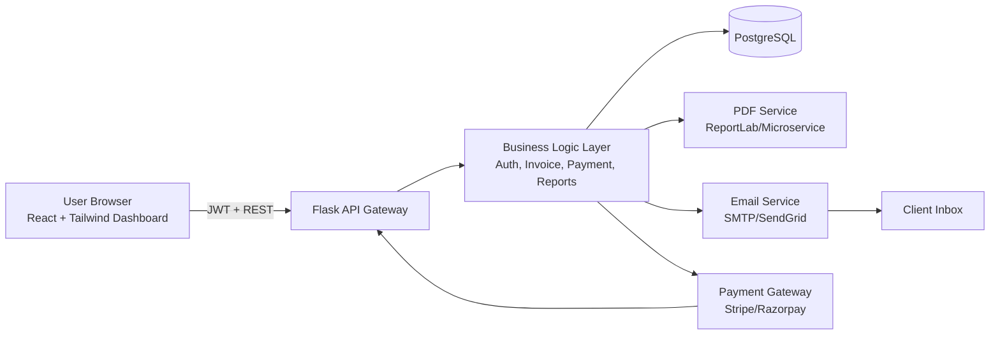

# SmartInvoice – AI Powered Invoice Management Platform

## 1) Complete System Architecture Diagram



### Invoice Data Flow (User → Email Sent)
1. User creates invoice in React dashboard.
2. Frontend sends `POST /api/invoices` with JWT.
3. Flask validates payload, computes GST (CGST/SGST/IGST), stores invoice + items in PostgreSQL.
4. Invoice service triggers PDF generation and stores file path / URL.
5. Email service sends invoice attachment/link to customer.
6. Notification is created for delivery/engagement and invoice status is updated (`Sent`, `Viewed`, `Paid`, `Overdue`).

## 2) PostgreSQL Schema
- Full SQL schema is available in `db/schema.sql`.
- Includes tables: `users`, `companies`, `clients`, `invoices`, `invoice_items`, `payments`, `subscriptions`, `notifications`, and `company_users` for multi-user accounts.

## 3) Backend Flask API
- Entry point: `backend/run.py`
- App factory and extensions: `backend/app/__init__.py`
- Routes:
  - Auth: `POST /api/register`, `POST /api/login`, `POST /api/logout`
  - Clients: `GET/POST/PUT/DELETE /api/clients`
  - Invoices: `GET/POST/GET(by id)/PUT/DELETE /api/invoices`
  - Payments: `POST /api/payments`, `GET /api/payments`
  - Reports: `GET /api/reports/revenue`, `GET /api/reports/outstanding`

## 4) React Dashboard UI
Implemented pages:
- Login
- Register
- Dashboard (KPIs + chart)
- Clients
- Invoices
- Create Invoice
- Invoice Detail
- Reports
- Settings

Main router is in `frontend/src/main.jsx`.

## 5) Folder Structure

```text
smartinvoice/
├── backend/
│   ├── app/
│   │   ├── controllers/
│   │   ├── models/
│   │   ├── routes/
│   │   ├── services/
│   │   └── utils/
│   ├── requirements.txt
│   ├── Dockerfile
│   └── run.py
├── frontend/
│   ├── src/
│   │   ├── api/
│   │   ├── components/
│   │   ├── layouts/
│   │   └── pages/
│   ├── Dockerfile
│   └── package.json
├── db/
│   └── schema.sql
├── docker-compose.yml
└── .github/workflows/ci.yml
```

## 6) Sample API Responses

### `POST /api/login`
```json
{
  "token": "eyJhbGciOi...",
  "user": { "id": 11, "email": "owner@company.com" }
}
```

### `GET /api/invoices`
```json
[
  {
    "id": 70,
    "invoice_number": "INV-2026-011",
    "status": "Sent",
    "total_amount": 24900.0,
    "due_date": "2026-03-25"
  }
]
```

### `GET /api/reports/revenue?company_id=1`
```json
{
  "company_id": 1,
  "revenue": 542000.0
}
```

## 7) Setup Instructions

### Local (without Docker)
1. Start PostgreSQL and create database.
2. Apply SQL: `psql -U smartinvoice -d smartinvoice -f db/schema.sql`
3. Backend:
   - `cd backend`
   - `python -m venv .venv && source .venv/bin/activate`
   - `pip install -r requirements.txt`
   - `python run.py`
4. Frontend:
   - `cd frontend`
   - `npm install`
   - `npm run dev`

### Docker
- `docker compose up --build`
- Frontend: `http://localhost:5173`
- API health: `http://localhost:5000/health`

## 8) Security Design
- JWT-based API auth (`flask-jwt-extended`).
- Password hashing with bcrypt.
- Input checking for required fields in controllers.
- Role guard helper (`role_required`) for RBAC extension.
- CORS allowlist via env vars.
- Secrets managed via `.env` and deployment secret manager.

## 9) DevOps / Deployment
- Dockerized frontend/backend/database.
- GitHub Actions pipeline with backend syntax check and frontend build.
- Cloud-ready for ECS, Kubernetes, Render, Railway, Fly.io, etc.
- Recommended production add-ons:
  - Nginx API gateway
  - Redis for job queues/reminders
  - Celery/RQ for reminder emails + recurring invoice generation
  - S3/GCS for PDF storage

## 10) Development Roadmap
- **Phase 1 (MVP):** Auth, clients, invoices, PDF, manual payments.
- **Phase 2:** Email tracking, recurring invoices, reminders, advanced dashboards.
- **Phase 3:** Stripe/Razorpay checkout links, subscription billing, webhook reconciliation.
- **Phase 4:** AI insights (cashflow prediction, late-payment risk scoring, auto follow-up drafts).

## 11) SaaS Monetization Model
- **Free:** 5 invoices/month, basic dashboard.
- **Starter ($9/mo):** 200 invoices, branding, recurring invoices.
- **Growth ($29/mo):** unlimited invoices, team accounts, automation, GST reports.
- **Business ($79/mo):** advanced analytics, API access, priority support.
- Optional usage add-ons: additional AI credits, extra team seats, white-label domain.
